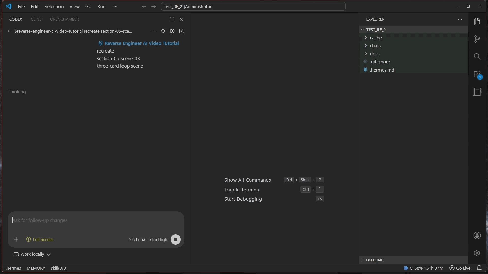

# reverse-engineer-ai-video-tutorial

Evidence-backed Cursor / Codex skill for turning AI video tutorials into reusable guides, with faithful scene recreation from those guides.

Guides can also serve as production systems for new work while keeping source evidence separate from generated content.

Watch the [10-minute YouTube walkthrough](https://www.youtube.com/watch?v=sEfhY-ICW_M&t=272s) for a detailed explanation.



## Install with an agent — recommended

Codex:

```text
Install this skill for Codex: https://github.com/sato-note/reverse-engineer-ai-video-tutorial
```

Cursor:

```text
Install this skill for Cursor: https://github.com/sato-note/reverse-engineer-ai-video-tutorial
```

When repository already is current agent context, omit URL:

```text
Install this skill for Codex.
```

Agent detects host/OS, runs source validation and dry-run, installs in universal `~/.agents/skills`, runs `base` doctor, verifies receipt, and reports result. Optional workflow dependencies stay deferred until first matching task. Read [`AGENTS.md`](AGENTS.md) for machine-facing contract; read [`SKILL.md`](skills/reverse-engineer-ai-video-tutorial/SKILL.md) for tutorial-work rules.

Completion report includes version, target, provenance, receipt, payload hash, runtime route, capabilities, warnings, backup, and rollback.

Other Agent Skills-compatible hosts, including Claude Code and Gemini CLI, can install and use this skill with their host-native tools.

<details>
<summary>Advanced: audit-first prompt</summary>

```text
Install this skill from immutable release tag <tag> for <Codex|Cursor>. Read AGENTS.md, README.md, skills/reverse-engineer-ai-video-tutorial/SKILL.md, skills/reverse-engineer-ai-video-tutorial/VERSION, and release notes. Show dry-run. Ask before privileged changes, native package installs, PATH edits, external downloads, paid calls, host-specific compatibility copies, or replacing an existing install. Install once in universal user skill storage. For install-only requests, run base doctor and defer optional dependencies. For a stated workflow, prepare only required capability and run its scoped doctor. Verify receipt after use, then report version, paths, provenance, runtime route, capabilities, warnings, backup, and rollback.
```

</details>

## Install manually — fallback

For local checkout, use stdlib-only installer with universal host selector:

```powershell
py -3 skills/reverse-engineer-ai-video-tutorial/scripts/install_skill.py --source . --host shared --dry-run --json
py -3 skills/reverse-engineer-ai-video-tutorial/scripts/install_skill.py --source . --host shared --json
```

`--host shared` is the Codex/Cursor default. Use `--host codex` or `--host cursor` only for an explicitly requested compatibility copy. `--target` and `--skills-root` remain advanced options; conflicting host/path combinations fail safely. `--force` is required for replacement/update; `--rollback` restores receipt-linked backup; `--verify` checks receipt and payload hashes.

For immutable GitHub provenance, clone exact release tag with Git metadata intact:

```powershell
git clone --branch v0.0.1 --depth 1 https://github.com/sato-note/reverse-engineer-ai-video-tutorial reverse-engineer-ai-video-tutorial
py -3 reverse-engineer-ai-video-tutorial/skills/reverse-engineer-ai-video-tutorial/scripts/install_skill.py --source reverse-engineer-ai-video-tutorial --host shared --github --json
```

Windows wrapper defaults to universal storage. Replacement requires explicit `-Force`; `-Help` is read-only:

```powershell
.\skills\reverse-engineer-ai-video-tutorial\scripts\install_global.ps1 -Json
.\skills\reverse-engineer-ai-video-tutorial\scripts\install_global.ps1 -Help
.\skills\reverse-engineer-ai-video-tutorial\scripts\install_global.ps1 -Force -Json
```

POSIX wrapper:

```sh
sh ./skills/reverse-engineer-ai-video-tutorial/scripts/install_skill.sh --host shared --json
```

Manual path retains full runtime, framework, update, rollback, and troubleshooting controls below. Installer does not install system packages, edit PATH, request credentials, upload user data, or make paid calls.

## Capabilities

| Profile | Supports | Required extras |
|---|---|---|
| `base` | guide metadata, local text/transcript work | Python 3.11–3.14, Pillow, writable workspace |
| `local-guide` | local video guide workflow | FFmpeg + FFprobe |
| `youtube-guide` | YouTube guide workflow | FFmpeg + FFprobe + standalone `yt-dlp` executable or Python `yt_dlp` module + `youtube-transcript-api` |
| `recreate` | scene reconstruction and video QA | FFmpeg + FFprobe |
| `remotion` | editable Remotion delivery | FFmpeg + FFprobe + Node.js + npm |
| `hyperframes` | editable HyperFrames delivery | HyperFrames CLI/skill, Node.js 22+, FFmpeg |

| Host | Status |
|---|---|
| Windows | Verified: install, doctor, runtime, spaced/Unicode paths, rollback, Remotion smoke. |
| macOS/Linux/WSL | Implemented to platform standards; untested. |

The agent checks only the selected workflow; missing optional capabilities do not block other routes.

## Clean-machine behavior

On a fresh machine, the agent detects the OS and available tools, installs the skill, then verifies base readiness. It prepares only dependencies needed for the requested workflow. Downloads and system changes require approval; missing optional tools defer only related capabilities. The agent reports what is ready and any remaining blockers.

## Workflow

The skill separates source evidence, reconstruction decisions, and generated output. It preserves prompts, settings, assets, typography, motion, tool routes, provenance, hashes, and QA results.

- Guide: ingest YouTube or local tutorial, recover workflow evidence, reconcile facts, publish a guide.

  Example prompt:

  ```text
  $reverse-engineer-ai-video-tutorial
  https://www.youtube.com/watch?v=7wuYBfE131U
  create a standalone guide.
  ```

- Recreate: select a named scene from a published guide, lock its exact route, rebuild, render, and compare.

  Example prompt:

  ```text
  $reverse-engineer-ai-video-tutorial
  recreate
  scene-01 from the guide
  ```

- Create: reuse a recovered method or visual system while keeping new work separate from source evidence.

Guide publication is transactional: normalize/register edited JSON, validate `evidence-complete`, run `publish-guide` (which performs the prepublication guide gate), then validate final `guide-complete`. A failed preflight does not write the public snapshot.

During recreation, the agent follows the guide's recorded production route, checks the required capabilities, asks before any external setup, then scaffolds and validates the matching framework project.

## Package boundary

Canonical GitHub/host install directory: `skills/reverse-engineer-ai-video-tutorial/`.

Immutable install source: release tag `v0.0.1`, canonical subtree `skills/reverse-engineer-ai-video-tutorial/`.

Selected install payload:

```text
skills/reverse-engineer-ai-video-tutorial/
  SKILL.md  VERSION  LICENSE  requirements.in  requirements.lock
  agents/   assets/   references/   scripts/
```

README, `AGENTS.md`, changelog, contributor policy, CI, public tests, and Git metadata are repository files, not installed skill payload. Custom and stock installers must select canonical subdirectory only.

## Contributing and releases

Use pull requests with one coherent concern. Follow [`CONTRIBUTING.md`](CONTRIBUTING.md) for branch names, required checks, review standards, dependency policy, changelog rules, and release versioning. Track user-visible changes in [`CHANGELOG.md`](CHANGELOG.md).

## License and external terms

Project source is MIT-licensed; see [`LICENSE`](LICENSE). Tutorial videos, source materials, fonts, provider/model outputs, external tools, and dependencies may have separate terms. MIT licensing does not grant rights to third-party tutorial content or generated media.
